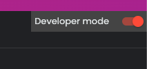

<h1 align="center" id="title">Javascript Injector Deluce</h1>

<p align="center"></p>
<p align="center"></p>

<p id="description">Chrome extension to inject JavaScript code manually in your webs.</p>

<h2>🛠️ Installation Steps:</h2>

<p>1. Go to chrome extensions</p>

```
Insert this in the URL chrome://extensions
```

<p>2. Enable developer mode</p>



<p>3. Upload the project repo</p>

```
click load unpacked
```


<p>4. pin the extension for convenience</p>

